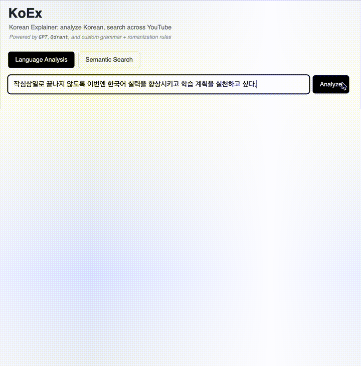
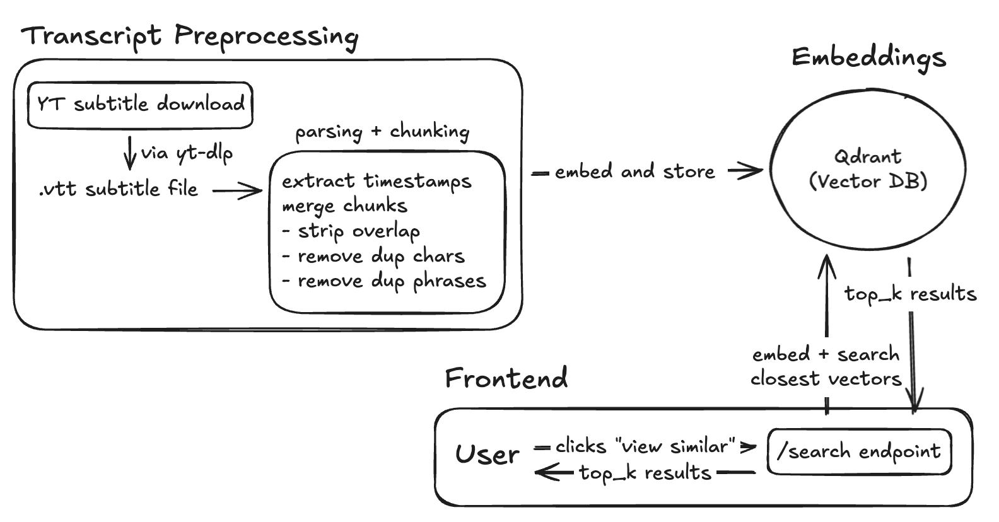

# KoEx

*Korean Explainer* is an AI-powered tool for Korean language learning.

## Features

### Language Analysis
- Custom interlinear romanization with morpheme-level separation
- Extraction of meaningful Korean words with part-of-speech tags, Korean definitions, and example sentences
- Korean-to-Hanja conversion
  - Per-Hanja annotations: Pinyin, 훈음, and English gloss
- Smart tokenization via custom rule-based chunking
  - Idiom (사자성어) and fixed expression preservation
  - Auxiliary grammar grouping (i.e. 하고 싶다, 할 수 있다, 나가야 하다)
  - Morphological recombination (i.e. 변화/NNG + 하/XSV → 변화하다)
  - Contraction normalization (i.e. 봤어요 → 보다 + 았어요)
  - Stopword removal
  - YAML-configured grammar rule engine for scalability and easy rule expansion

### Search

- Semantic search across Korean YouTube transcripts and documents
- Vector search powered by OpenAI (`text-embedding-3-small`) + Qdrant

## Roadmap

### 🚧 In Progress
- [x] Expand idiom + fixed expression detection
- [x] Handle negation patterns in verbs (i.e. -지 않다, -지 못하다) 
- [ ] Semantic + vector search (OpenAI + Qdrant)
- [ ] YouTube transcript extraction and chunking

### 🧩 Planned
- [ ] YouTube player with live analysis
- [ ] Full sentence contextual explanations (GPT-powered)
- [ ] Word saving + graph visualization (shared Hanja network)
- [ ] Voice playback of glossed sentences
- [ ] Support for stroke order animations
- [ ] Handle honorifics
- [ ] Support more complex grammar: conjunctions, quotatives, and adnominal forms (i.e. -지만, -다고 하다, -는 것)
- [ ] Improve parsing for numeral + counter units
