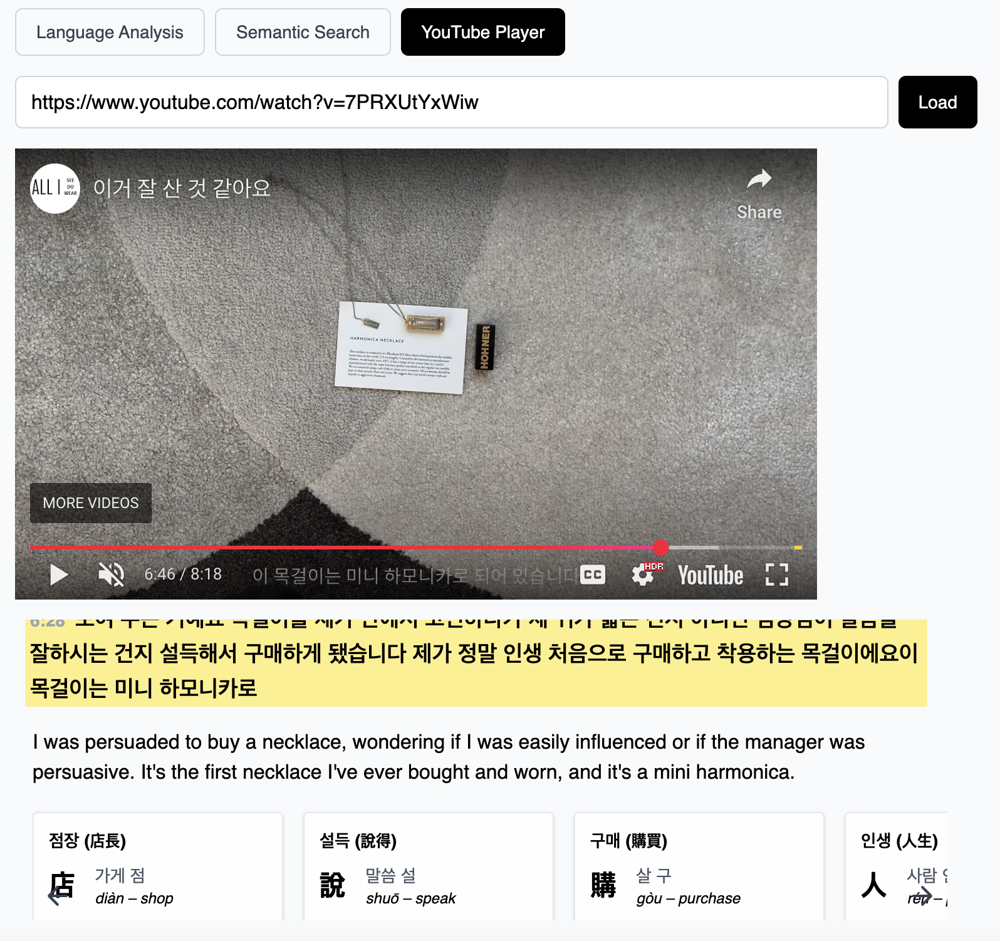
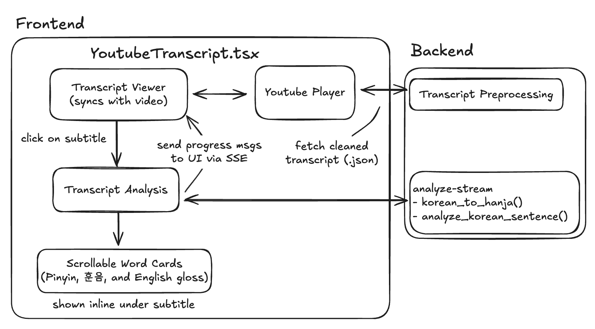

# Youtube Player

This feature lets users input a YouTube link, play the video, and interact with a synchronized transcript. As the video plays, the current subtitle is highlighted. Clicking on a subtitle triggers a language analysis directly below the selected line. 

## Architecture

Frontend
- `YouTubeTranscript.tsx`
  - `YoutubePlayer`: displays the video and tracks current time
  - `TranscriptViewer`: renders subtitle lines; clicking one conditionally displays `TranscriptAnalysis`
- `TranscriptAnalysis.tsx`
  - Connects to backend via SSE
  - Displays:
    - Sentence gloss (via GPT)
    - Scrollable Hanja cards with Pinyin, 훈음, and English glosses

Backend
- **Transcript Preprocessing**
  - Fetch `.vtt` subtitles from YouTube
  - Parse and segment by character/token limits
  - Clean the result:
    - Remove duplicates
    - Strip overlaps at chunk boundaries
  - Output a cleaned `.json` transcript
- **Analysis Pipeline**
  - `analyze-stream` - SSE endpoint that streams progress + final result
    - `korean_to_hanja()` - extracts Hanja mappings
    - `analyze_korean_sentence()` - generates subtitle gloss using GPT 

Flow
1. User provides a YouTube link and presses **Load**
2. Transcript is fetched, parsed, and cleaned
3. Clicking a subtitle:
   - Sends a request to `analyze-stream`
   - Streams progress messages inline under subtitle
   - Displays gloss and Hanja cards on completion

## Design Decisions

### 1. Progressive Analysis via SSE
We use Server-Sent Events to stream progress messages to the user. This gives the user feedback and avoids waiting without notice while the backend applies grammar rules for tokenization + GPT calls.

### 2. Why Not Precompute All Chunks?
Precomputing all subtitle chunks would:
- Delay transcript rendering
- Clutter the UI with output
- Increase GPT usage and cost

Instead, we only perform analysis when the user clicks on a subtitle.