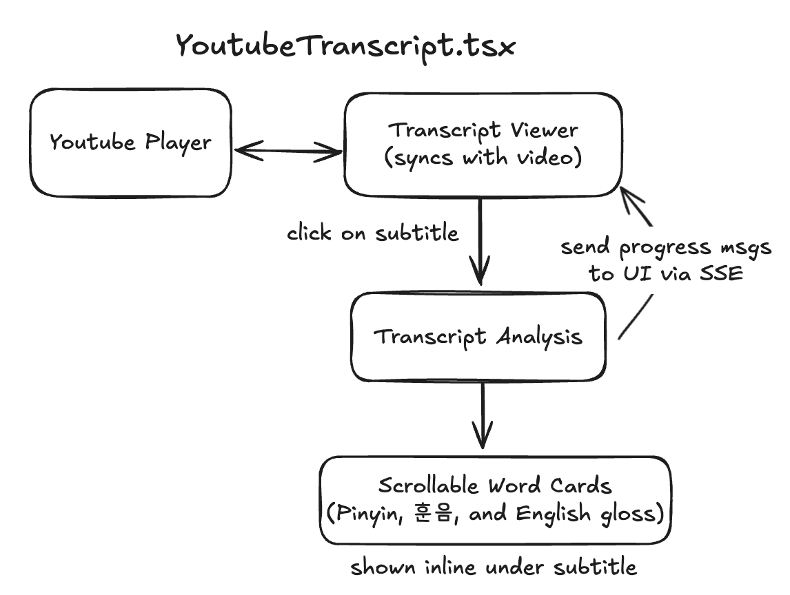

# Youtube Player

This feature lets users input a YouTube link, play the video, and interact with a synchronized transcript. As the video plays, the current subtitle is highlighted. Clicking on a subtitle triggers a language analysis directly below the selected line.

---

## Architecture

Frontend
- `YouTubeTranscript.tsx`
  - `YoutubePlayer`: displays the video and tracks current time
  - `TranscriptViewer`: renders subtitle lines; clicking one conditionally displays `TranscriptAnalysis`
- `TranscriptAnalysis.tsx`
  - Streams results from the backend via SSE
  - Displays:
    - Sentence gloss/translation (via GPT)
    - Scrollable Hanja cards with Pinyin, 훈음, and English glosses

Backend
- `analyze-stream` - SSE endpoint that streams progress messages and results
- `korean_to_hanja()` - handles the hanja info portion of language analysis
- `analyze_korean_sentence()` - generates subtitle translation using GPT 

Flow
1. User provides a YouTube link and presses **Load**
2. Transcript is fetched and cleaned:
   - Deduplicates repeated lines
   - Strips overlaps across subtitle chunk boundaries
3. When a subtitle is clicked:
   - An SSE request is sent to `analyze-stream`
   - Progress messages are streamed below the clicked subtitle
   - Final output includes:
     - English translation of the sentence
     - Annotated Hanja cards for meaningful base words

## Design Decisions

### 1. Progressive Analysis via SSE
We use Server-Sent Events to stream progress messages to the user. This gives the user feedback and avoids waiting without notice while the backend applies grammar rules for tokenization + GPT calls.

### 2. Why Not Precompute All Chunks?
We intentionally **do not precompute the analysis for all subtitle chunks**. Precomputing would:
- Delay transcript rendering
- Clutter the UI with output
- Increase GPT usage and cost

Instead, we only perform analysis when the user clicks on a subtitle.